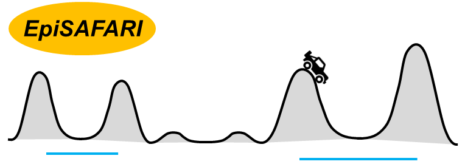
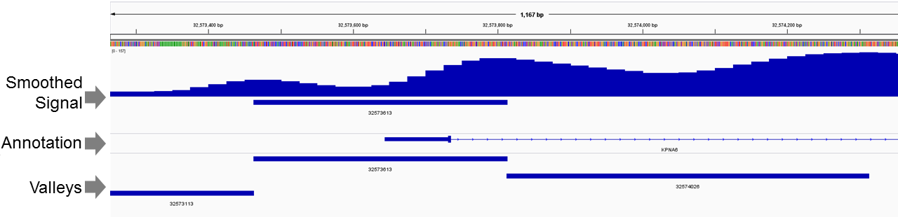

<html>
<font face="arial">
<div style="text-align:center"></div>
<h1>EpiSAFARI</h1>
EpiSAFARI is a command line tool for detection of valley shaped patterns from the functional genomics signal profiles. <br><br>
<div style="padding:8px;background-color:#ddd;line-height:1.4;">
- Signal Profile in bedGraph format, <br>
- Mapped reads in SAM/bowtie/eland/... format. <br>
</div><br>
and outputs:<br>
<div style="padding:8px;background-color:#ddd;line-height:1.4;">
- The spline smoothed signal profile. <br>
- The valleys, local minima and maxima in the signal profile. <br>
- Gene and transcription factors annotations, mappability values and nucleotide content for the valley.
</div>
<br>

The output is formatted as an extended BED file with multiple columns. Please refer below for the specification of output file format.

<h2>Download and Installation</h2>
You can download EpiSAFARI code by clicking on the green "Clone or Download" button and downloading zip or by checking out via git. After that, navigate to the checkout (or download) directory. If you downloaded the zip file of the source, unzip it using "unzip master.zip".<br><br>

You need to have g++, GSL, and zLib libraries installed for building EpiSAFARI. If they are not installed, type:
```
sudo yum -y install gsl gsl-devel gcc-c++ zlib zlib-devel
```

This should install the necessary GSL libraries for building EpiSAFARI correctly.<br><br>

Now EpiSAFARI can be built using:<br>
```
make clean
make
```
The executable is located under directory <font face="courier">bin/</font>. 

It may be useful to install <a href="http://samtools.sourceforge.net/">samtools</a> for processing BAM files.

To get help on which options are available, use:
```
./bin/EpiSAFARI -help
```

<h2>Parameter Selection and Impact of Parameters on Detected Valleys</h2>
EpiSAFARI uses a spline smoothing procedure with several parameters and these parameters can have impact on the sensitivity of the method.<br>

The spline smoothing is based on projecting the epigenetic signal profile on basis splines and removing noise. The basis splines are defined in terms of a spline degree and a set of knots. <br>

We generally observed that overly simple and complex smoothing causes underfitting and overfitting of the data and this decreases sensitivity of valley detection.

<h3>Knot Selection</h3>
The number of knots, and the placement of knots are important factors while smoothing the signal. We generally observed that increasing knot number above 7 creates overfitting when using windows of length 1000 base pairs. 

On the other hand, the using a knot number below 6 seems to decrease sensitivitiy similarly because smoothed signal profile is underfit, i.e., does not represent the original signal well. Thus EpiSAFARI uses 7 knots by default.<br>

The placements of knots along the signal domain is an open problem in spline based smoothing of signals. We compared several knot placement strategies (Uniform, Derivative-based, and Random) and found that uniform knot placement generally works comparable in accuracy as other knot placement strategies.<br>

If it is necessary, the users can change the knot selection parameters while spline smoothing the data (See below)

<h3>Spline Degree</h3>
The spline degree tunes polynomial complexity of the basis spline curves. We observed that increasing the degree above 5 may cause overfitting and setting it below 3 may cause underfitting. Thus, by
default, EpiSAFARI uses degree of 5.

If it is necessary, this parameter while data is being smoothed using "-bspline_encode" option (See below).

<h3>Setting the Number of Coefficients with new Spline Degree and Knot Selections</h3>
If the spline degree or knot number is changed, the number of coefficients can be computed simply as (number of knots) + (spline degree) - 2. This value should be used as the number of coefficients
parameter while spline smoothing the data.

<h3>Window length</h3>
The window length specifies the length of the window that is used while smoothing the data. Signal in each window is smoothed then concatenated. The large window lengths creates a large signal for smoothing.
Therefore the knot numbers must be adjusted with the increasing window length. By fefault, EpiSAFARI's parameters are selections work well with 1000 base pair windows for dense signals. For sparse signals, such as
DNA methylation, EpiSAFARI uses 5000 base pair long windows by default.

This parameter can be changed while data is being smoothed.

<h3>Hill Score Thresholds</h3>
EpiSAFARI reports a hill score between 0 and 1 that is used to measure the topological quality of valleys. Hill score of 1 represents a valley that shows monotonically increasing signal while moving from the valley's dip to the summits.<br>

The reported valleys must be filtered with respect to the reported hill scores. We observed that there is very high enrichment of valleys with hill scores close to 1.0. These valleys represent biologically meaningful valleys. Therefore EpiSAFARI uses hill score threshold of 0.99<br>

If the hill score threshold is decreased, the valley redundancy increases: The fraction of reported valleys with overlaps increase. Depending on the application, this may be a useful and intended behaviour.<br>

<h2>Usage Examples</h2>
EpiSAFARI run starts with setting up the input files. (Note that we use samtools for converting BAM file to SAM files.). EpiSAFARI can take bedGraph files and mapped reads
directly as input. It is necessary to divide the data into chromosomes.

<h2>Building input with bedGraph and bigWig files</h2>

We show an example from ENCODE project below:

```
wget -c http://hgdownload.soe.ucsc.edu/goldenPath/hg19/encodeDCC/wgEncodeBroadHistone/wgEncodeBroadHistoneGm12878H3k04me3StdSigV2.bigWig
wget http://hgdownload.soe.ucsc.edu/admin/exe/linux.x86_64/bigWigToBedGraph
chmod 755 bigWigToBedGraph
./bigWigToBedGraph wgEncodeBroadHistoneGm12878H3k04me3StdSigV2.bigWig wgEncodeBroadHistoneGm12878H3k04me3StdSigV2.bigWig.bgr
mkdir bedGraphs
./bin/EpiSAFARI -separate_bedGraph_2_chromosomes wgEncodeBroadHistoneGm12878H3k04me3StdSigV2.bigWig.bgr bedGraphs
```
If there are multiple replicates to be pooled, they can be done at once or separately. If done separately, EpiSAFARI pools the bedGraphs automatically and uses the total signal profile in the analyses.<br>

<h2>Building input with mapped read files</h2>

EpiSAFARI can also process mapped read files, for example in SAM format. We show again an example from the ENCODE Project:

```
wget -c http://hgdownload.soe.ucsc.edu/goldenPath/hg19/encodeDCC/wgEncodeBroadHistone/wgEncodeBroadHistoneGm12878H3k4me3StdAlnRep1.bam
wget -c http://hgdownload.soe.ucsc.edu/goldenPath/hg19/encodeDCC/wgEncodeBroadHistone/wgEncodeBroadHistoneGm12878H3k4me3StdAlnRep2.bam

rm -f -r processed_reads
mkdir processed_reads
samtools view wgEncodeBroadHistoneGm12878H3k4me3StdAlnRep1.bam | EpiSAFARI -preprocess_reads SAM stdin processed_reads
samtools view wgEncodeBroadHistoneGm12878H3k4me3StdAlnRep2.bam | EpiSAFARI -preprocess_reads SAM stdin processed_reads
```
This example pools the 2 replicates of data. If there are more multiple replicates of reads to be pooled, they can be done at once or separately. If done separately, EpiSAFARI pools the reads automatically and uses the total signal profile in the analyses as in the example above.<br>

We strongly recommend removing duplicates from the reads. This decreases valley detection time quite much:<br>
```
mkdir processed_reads/sorted processed_reads/dedup
./bin/EpiSAFARI -sort_reads processed_reads processed_reads/sorted
./bin/EpiSAFARI -remove_duplicates processed_reads/sorted 2 processed_reads/dedup
```

<h2>Spline Fitting to the Data</h2>

After input files are setup, we perform spline fitting to the read coverage signals. The raw data generated by EpiSAFARI is rather large so it is useful to gzip them:
```
n_spline_coeffs=10
spline_order=5
max_max_err=5
max_avg_err=3
l_win=1000
sparse_data=0
l_post_filter=10
brkpt_type=0

## bedGraph files:
./bin/EpiSAFARI -bspline_encode bedGraphs ${n_spline_coeffs} ${spline_order} ${brkpt_type} ${max_max_err} ${max_avg_err} ${l_win} ${sparse_data} ${l_post_filter}

## mapped read files:
./bin/EpiSAFARI -bspline_encode processed_reads/dedup ${n_spline_coeffs} ${brkpt_type} ${spline_order} ${max_max_err} ${max_avg_err} ${l_win} ${sparse_data} ${l_post_filter}
```

<i>n_spline_coeffs</i> controls the number of knots that are used to fit b-spline. It should not be set to a very high value as this may cause overfitting of the data.<br>

<h2>Valley Detection</h2>
We next perform valley identification. We first download the multi-mappability signal then identify the valleys:<br>

```
seq_dir=hg19_seq
mmap_dir=hg19_36bp
mkdir hg19_36bp
cd hg19_36bp
wget -c http://archive.gersteinlab.org/proj/MUSIC/multimap_profiles/hg19/hg19_36bp.tar.bz2
tar -xvjf hg19_36bp.tar.bz2
cd ..
mkdir hg19_seq
cd hg19_seq
wget -c http://hgdownload.soe.ucsc.edu/goldenPath/hg19/bigZips/chromFa.tar.gz
tar -xvzf chromFa.tar.gz
../bin/EpiSAFARI -preprocess_FASTA . fa .
cd ..
max_trough_sig=1000
min_summit_sig=5
min_summit2trough_frac=1.2
max_summit2trough_dist=1000
min_summit2trough_dist=0
min_multimapp=1.2
sparse_data=0
pval_type=0

## bedGraph files:
EpiSAFARI -get_significant_extrema bedGraphs ${max_trough_sig} ${min_summit_sig} ${min_summit2trough_frac} ${min_summit2trough_dist} ${max_summit2trough_dist} ${mmap_dir} ${min_multimapp} ${seq_dir} 0.1 ${sparse_data} ${pval_type}
all_valleys_fp=bedGraphs/significant_valleys.bed

## mapped read files:
EpiSAFARI -get_significant_extrema processed_reads/dedup ${max_trough_sig} ${min_summit_sig} ${min_summit2trough_frac} ${min_summit2trough_dist} ${max_summit2trough_dist} ${mmap_dir} ${min_multimapp} ${seq_dir} 0.1 ${sparse_data} ${pval_type}
all_valleys_fp=processed_reads/dedup/significant_valleys.bed

# Filter: Remove valleys with FDR higher than log(0.05), hill scores lower than 0.99 and average multi-mappability higher than 1.2.
cat ${all_valleys_fp} | awk {'if(NR==1){print $0};if($18<-3 && $10>=0.99 && $11>=0.99 && $8<1.2)print $0'} > sign.bed

# Merge valleys with dips closer than 200 base pairs.
EpiSAFARI -merge_valleys sign.bed 200 merged_sign.bed

```

<h2>Valley Annotation</h2>

We finally perform valley annotation. We first download the GENCODE gene annotation gff file:

```
wget -c ftp://ftp.ebi.ac.uk/pub/databases/gencode/Gencode_human/release_19/gencode.v19.annotation.gff3.gz

l_promoter=1000

## bedGraph files:
./bin/EpiSAFARI -annotate_features merged_sign.bed gencode.v19.annotation.gff3.gz ${l_promoter} annotated_features.bed

```

Finally, you can also add ENCODE2 transcription factor binding annotations. We have built the GFF file for the uniformly processed peaks of 690 transcription factors from the ENCODE2 cell lines that you can download and use to annotate the features:

```
wget -c http://harmancilab.org/tools/EpiSAFARI/wgEncodeAwgTfbs.gff.gz
./bin/EpiSAFARI -annotate_features merged_sign.bed wgEncodeAwgTfbs.gff.gz 0 annotated_features.bed
```

Annotation adds a new annotation column to every entry in the valleys file and automatically updates the header.

<h2>Sparse Mode</h2>

EpiSAFARI can also process sparse signals. Examples of these include DNA methylation data, which happens only at cytosine nucleotides. For this, run EpiSAFARI with sparse_data=1 to enable sparse signal smoothing. We also turn on post-median filter on.<br>

We demonstrate this option on the DNA methylation data for H1hESC cell line from Roadmap Epigenome Project:
```
wget -c ftp://ftp.genboree.org/EpigenomeAtlas/Current-Release/experiment-sample/Bisulfite-Seq/H1_Cell_Line/UCSD.H1.Bisulfite-Seq.combined.wig.gz

wget http://hgdownload.cse.ucsc.edu/admin/exe/linux.x86_64/bigWigToBedGraph
wget http://hgdownload.cse.ucsc.edu/admin/exe/linux.x86_64/wigToBigWig
wget http://hgdownload.cse.ucsc.edu/admin/exe/linux.x86_64/fetchChromSizes
chmod 755 fetchChromSizes
chmod 755 wigToBigWig
chmod 755 bigWigToBedGraph

gzip -cd UCSD.H1.Bisulfite-Seq.combined.wig.gz > UCSD.H1.Bisulfite-Seq.combined.wig
./fetchChromSizes hg19 > hg19.list
./wigToBigWig UCSD.H1.Bisulfite-Seq.combined.wig hg19.list UCSD.H1.Bisulfite-Seq.combined.wig.bw
./bigWigToBedGraph UCSD.H1.Bisulfite-Seq.combined.wig.bw UCSD.H1.Bisulfite-Seq.combined.wig.bw.bgr

mkdir DNAm_bgrs
./bin/EpiSAFARI -separate_bedGraph_2_chromosomes UCSD.H1.Bisulfite-Seq.combined.wig.bw.bgr DNAm_bgrs

n_spline_coeffs=10
spline_order=5
max_max_err=0.3
max_avg_err=0.3
l_win=5000
sparse_data=1 
l_post_filter=50
brkpt_type=0

./bin/EpiSAFARI -bspline_encode DNAm_bgrs ${n_spline_coeffs} ${spline_order} ${brkpt_type} ${max_max_err} ${max_avg_err} ${l_win} ${sparse_data} ${l_post_filter}
 
# Compute valleys.
seq_dir=hg19_seq
mmap_dir=hg19_36bp
max_trough_sig=1000
min_summit_sig=0.7
min_summit2trough_frac=1.2
max_summit2trough_dist=2000
min_summit2trough_dist=250
min_multimapp=1.2
sparse_data=1
pval_type=0

EpiSAFARI -get_significant_extrema DNAm_bgrs ${max_trough_sig} ${min_summit_sig} ${min_summit2trough_frac} ${min_summit2trough_dist} ${max_summit2trough_dist} ${mmap_dir} ${min_multimapp} ${seq_dir} 0.1 ${sparse_data} ${pval_type}

# Filter: Remove methyl-valleys with FDR higher than log(0.05), CpG count less than 20, hill score less than 0.99, and GC content less than 0.4.
cat DNAm_bgrs/significant_valleys.bed | awk {'if(NR==1){print $0};if($18<-3 && $16>20 && $10>=0.99 && $11>=0.99 && $8<1.2 && ($13+$14)/($12+$13+$14+$15)>0.4)print $0'} > sign.bed

# Merge the methl-valleys whose minima are within 200 base pairs of each other.
EpiSAFARI -merge_valleys sign.bed 200 merged_sign.bed

./bin/EpiSAFARI -annotate_features merged_sign.bed wgEncodeAwgTfbs.gff.gz 0 annotated_features.bed

```

<h2>Visualization of the Signal</h2>

IGV can be used to visualize the spline coded signals. These are stored as bedGraphs files under data directory. <br><br>

To visualize the spline smoothed signal profile for chromosome 1, use following:
```
wget http://hgdownload.cse.ucsc.edu/admin/exe/linux.x86_64/bedGraphToBigWig
chmod 755 bedGraphToBigWig
gzip -cd bedGraphs/spline_coded_1.bgr.gz > bedGraphs/spline_coded_1.bgr
sed -i 's/chr//g' hg19.list
bedGraphToBigWig bedGraphs/spline_coded_1.bgr hg19.list spline_coded_1.bgr.bw
```

The bigWig file named <i>spline_coded_1.bgr.bw</i> can be opened in IGV to visualize the spline smoothed signal. An example is shown below:<br><br>

<div style="text-align:center;"></div>

<h2>Output format</h2>
EpiSAFARI outputs the identified valleys to a BED file named "significant_valleys.bed".<br><br>

This is an extended bed file with following columns:<br>
<div style="padding:8px;background-color:#ddd;line-height:1.4;">
<i><font face="courier">
<ol>
<li>[Chromosome]: Chromosome ID </li>
<li>[Left maxima position]: Position the left maximum of the valley	</li>
<li>[Right maxima position]: Position the right maximum of the valley </li>
<li>[Minima position]: Position of the minimum of the valley </li>
<li>[Left maxima signal]: Signal at the left maxima	</li>
<li>[Right maxima signal]: Signal at the right maxima </li>
<li>[Minima signal]: Signal at the minima </li>
<li>[Average multi-mappability signal]: Average multi-mappability signal on the valley </li>
<li>[Maximum multi-mappability signal]: MAximum multi-mappability signal on the valley </li>
<li>[Left hill quality]: Fraction of the nucleotides on the left hill</li>
<li>[Right hill quality]: Fraction of the nucleotides on the right hill</li>
<li>[A count]: Count of A nucleotides in the valley</li>
<li>[C count]: Count of C nucleotides in the valley</li>
<li>[G count]: Count of G nucleotides in the valley</li>
<li>[T count]: Count of T nucleotides in the valley</li>
<li>[CpG count]: Count of CpG dinucleotides in the valley
<li>[P-value]: P-value of the valley
<li>[FDR]: False discovery rate at which valley is deemed significant
<li>[Annotation]: Annotated element's name and type of the element (gene, exon, transcript, promoter, TF_peak)</li>
</font></i>
</div><br>

<h2>Assigning Valleys to Promoters and Detection of Supervalleys</h2>

EpiSAFARI can assign the valleys to the gene promoters to identify a tentatie list of supervalleys around gene promoters.

```
# Download GENCODE Annotations.
wget -c ftp://ftp.ebi.ac.uk/pub/databases/gencode/Gencode_human/release_19/gencode.v19.annotation.gff3.gz

# Parse the promoters
gzip -cd gencode.v19.annotation.gff3.gz | awk 'BEGIN{FS="\t"}{if($3=="gene"){gene_start=$4;if($7=="-"){gene_start=$5;};split($9, arr, ";");for(i=1;i<=length(arr);i++){if (arr[i] ~/gene_name=/){gene_name=arr[i]}};print $1"\t"gene_start-10000"\t"gene_start+10000"\t"gene_name"\t.\t"$7}}' > promoters.bed

# Assign the valleys to the gene promoters.
EpiSAFARI -assign_valleys_2_regions promoters.bed merged_sign.bed valleys_2_promoters.bed

# Sort the promoters with respect to number of valleys around promoter and get a list of the gene symbols.
sort -n -k7,7 valleys_2_promoters.bed -r | head -n 200 | awk {'print $4'} | sort -u > genes_with_supervalleys.list
```

</html>